# Project "QRLogic" | Проєкт "QRLogic"

## __Purpose of the Project__ | __Мета створення проєкту__

This project was created as a practice over a Django module. Its purpose was to learn the key features of the module and improve our coding skills<br> <br> Цей проєкт створений для практики з модулем Django. Його метою було вивчити ключові можливості модуля, вдосконалити наші скіли в кодингу

## __Plan-navigation for README__ | __План-навігація по README__
* [Purpose of the Project | Мета створення проєкту](#purpose-of-the-project--мета-створення-проєкту)<br>
* [Team members | Склад команди](#team-members--склад-команди)<br>
* [Project structure | Структура проєкту](#project-structure--структура-проєкту)<br>
* [Explanation of application specifications | Пояснення специфікації застосунків](#explanation-of-application-specifications--пояснення-специфікації-застосунків)<br>
* [Useful project-related links | Корисні посилання стосовно проекту](#useful-project-related-links--корисні-посилання-стосовно-проекту)<br>
* [Project installation guide | Інструкція до встановлення проєкту](#project-installation-guide--інструкція-до-встановлення-проєкту)<br>
* [Сonclusion | Висновок](#conclusion--висновок)<br>

## __Team members__ | __Склад команди__

* [Дмитро Печенюк](https://github.com/DmitriyPechenyuk0) Teamlead
* [Нікіта Емріх](https://github.com/NikitaEmrih)


## __Project structure__ | __Структура проєкту__

```mermaid
flowchart TB

A(QRLogic) --> Q(QRLogic)
Q(QRLogic) --> __init__.py
Q(QRLogic) --> QQA(asgi.py)
Q(QRLogic) --> QQS(settings.py)
Q(QRLogic) --> QQU(urls.py)
Q(QRLogic) --> QQW(wsgi.py)

A(QRLogic) --> C(createqr_app) 
C(createqr_app) --> CS(static)
C(createqr_app) --> CT(templates)
C(createqr_app) --> CCI(__init__.py)
C(createqr_app) --> CCA(admin.py)
C(createqr_app) --> CCCA(apps.py)
C(createqr_app) --> CCM(models.py)
C(createqr_app) --> CCT(tests.py)
C(createqr_app) --> CCU(urls.py)
C(createqr_app) --> CCV(views.py)
CT(templates) --> authentication_required.html
CT(templates) --> createqrr.html
CS(static)  --> CSS(css)
CS(static)  --> CSJ(js)
CS(static)  --> CSI(images)
CSS(css) --> authentication_required.css
CSS(css) --> createqr.css
CSJ(js) --> createqr.js

A(QRLogic) --> Y(yourqr_app)

Y(yourqr_app) --> YS(static)
Y(yourqr_app) --> YT(templates)
Y(yourqr_app) --> YYI(__init__.py)
Y(yourqr_app) --> YYA(admin.py)
Y(yourqr_app) --> YYYA(apps.py)
Y(yourqr_app) --> YYM(models.py)
Y(yourqr_app) --> YYT(tests.py)
Y(yourqr_app) --> YYU(urls.py)
Y(yourqr_app) --> YYV(views.py)
YT(templates) --> yourqrr.html
YS(static)  --> YSS(css)
YSS(css) --> yourqrr.css



A(QRLogic) --> O(contact_app)

O(contact_app) --> OS(static)
O(contact_app) --> OT(templates)
O(contact_app) --> __init__.py
O(contact_app) --> OOA(admin.py)
O(contact_app) --> OOOA(apps.py)
O(contact_app) --> OOM(models.py)
O(contact_app) --> OOT(tests.py)
O(contact_app) --> OOU(urls.py)
O(contact_app) --> OOV(views.py)
OT(templates) --> contact.html
OS(static)  --> OSS(css)
OS(static)  --> OSI(images)
OSS(css) --> contactt.css


A(QRLogic) --> H(home_app)

H(home_app) --> HS(static)
H(home_app) --> HT(templates)
H(home_app) --> __init__.py
H(home_app) --> HHA(admin.py)
H(home_app) --> HHHA(apps.py)
H(home_app) --> HHM(models.py)
H(home_app) --> HHT(tests.py)
H(home_app) --> HHU(urls.py)
H(home_app) --> HHV(views.py)
HT(templates) --> home.html
HS(static)  --> HSS(css)
HS(static)  --> HSI(images)
HSS(css) --> homee.css


A(QRLogic) --> M(managesub_app)

M(managesub_app) --> MS(static)
M(managesub_app) --> MT(templates)
M(managesub_app) --> __init__.py
M(managesub_app) --> MMA(admin.py)
M(managesub_app) --> MMMA(apps.py)
M(managesub_app) --> MMM(models.py)
M(managesub_app) --> MMT(tests.py)
M(managesub_app) --> MMU(urls.py)
M(managesub_app) --> MMV(views.py)
MT(templates) --> managesub.html
MS(static)  --> MSS(css)
MS(static)  --> MSI(images)
MSS(css) --> managesub.css
MS(static)  --> MSJ(js)
MSJ(js) --> managesub.js


A(QRLogic) --> U(user_app)

U(user_app) --> US(static)
U(user_app) --> UT(templates)
U(user_app) --> __init__.py
U(user_app) --> UUA(admin.py)
U(user_app) --> UUUA(apps.py)
U(user_app) --> UUM(models.py)
U(user_app) --> UUT(tests.py)
U(user_app) --> UUU(urls.py)
U(user_app) --> UUV(views.py)
UT(templates) --> signin.html
UT(templates) --> signup.html
US(static)  --> USS(css)
US(static)  --> USI(img)
USS(css) --> signin.css
USS(css) --> signup.css





A(QRLogic) --> E(media)

A(QRLogic) --> S(static)

S(static) --> favicon.ico
S(static) --> SC(css)
S(static) --> images
SC(css) --> base_style.css

A(QRLogic) --> T(templates)

T(templates) --> base.html
A(QRLogic) --> B(db.sqlite3)
A(QRLogic) --> G(manage.py)


```



## __Explanation of application specifications.__ | __Пояснення специфікації застосунків__

<details>
  <summary><strong>QRLogic</strong></summary>

  ---
  #### EN
  > __QRLogic__ – This is the main app in the project. It handles the core project configurations.
  ---
  #### UA
  > __QRLogic__ – це головний застосунок у проєкті. Саме в цьому застосунку здійснюються основні налаштування проєкту.
  ---
</details>

<details>
  <summary><strong>home_app</strong></summary>

  ---
  #### EN
  > __home_app__ – This app is responsible for displaying and configuring the homepage.
  ---
  #### UA
  > __home_app__ – цей застосунок відповідає за відображення та налаштування головної сторінки.
  ---
</details>

<details>
  <summary><strong>user_app</strong></summary>

  ---
  #### EN
  > __user_app__ – This app is responsible for account creation, authentication, and logout. Additionally, this app includes the Profile model, which handles table creation in the database.
  ---
  #### UA
  > __user_app__ – цей застосунок відповідає за створення акаунта, авторизацію, а також вихід із нього. Крім того, у цьому застосунку створено модель Profile, яка відповідає за створення таблиці в БД.
  ---
</details>

<details>
  <summary><strong>contact_app</strong></summary>

  ---
  #### EN
  > __contact_app__ – This app is responsible for displaying and configuring the contacts page, as well as sending feedback via email.
  ---
  #### UA
  > __contact_app__ – цей застосунок відповідає за відображення та налаштування сторінки контактів, а також за надсилання відгуків на пошту.
  ---
</details>

<details>
  <summary><strong>managesub_app</strong></summary>

  ---
  #### EN
  > __managesub_app__ – this app is responsible for displaying and configuring the subscription settings page. It also includes the main logic for changing subscriptions. There are two types of subscriptions, divided into monthly and one-time purchases.  
  > Monthly subscriptions include Free, Standard, and Pro. The one-time purchase subscription is Commerce. A user can have both types of subscriptions simultaneously.  
  > With a monthly subscription, the user can create QR codes only with a link, and their validity period is 30 days.  
  > With a one-time purchase subscription, the user can create QR codes only with text, and their validity period is unlimited.  
  ---
  #### UA
  > __managesub_app__  – цей застосунок відповідає за відображення та налаштування сторінки налаштування підписки. Також у ньому прописана основна логіка зміни підписок. Є два типи підписок, які поділяються на щомісячні та одноразову покупку. Щомісячні підписки – це Free, Standard, Pro. Одноразово-купівельна підписка – це Commerce. Користувач може мати одночасно два типи підписки. З щомісячною підпискою користувач може створювати QR-коди тільки з посиланням, і їх строк придатності – 30 днів. З одноразово-купівельною підпискою користувач може створювати QR-коди тільки з текстом, і їх строк придатності – безмежний.
  ---

</details>

<details>
  <summary><strong>createqr_app</strong></summary>

  ---
  #### EN
  > __createqr_app__ – this app is responsible for displaying and configuring the QR code creation page. It also includes the logic for customizing QR codes.<br>
  >* If the user has a Free subscription, only basic color changes and the ability to create one QR code are available.
  >* If the user has a Standard subscription, they can create up to 10 QR codes with a logo in the center and color customization.
  >* If the user has a Pro subscription, they can create up to 100 QR codes with color customization, shape modification, and logo addition.
  >* If the user has a Commerce subscription, they can only customize the color of QR codes. If they want to change the shape or add a logo, they need to purchase the corresponding monthly subscription.
  ---
  #### UA
  > __createqr_app__ – цей застосунок відповідає за відображення та налаштування сторінки створення QR-кодів. Також у ньому прописана логіка кастомізації QR-кодів.<br>
  >* Якщо користувач має підписку Free, йому доступна лише базова зміна кольору та можливість створення одного QR-коду.
  >* Якщо користувач має підписку Standard, він може створювати до 10 QR-кодів із логотипом у центрі та кастомізацією кольору.
  >* Якщо користувач має підписку Pro, він може створювати до 100 QR-кодів із кастомізацією кольору, зміною форми квадратів та додаванням логотипа.
  >* Якщо користувач має підписку Commerce, він може створювати QR-коди лише з кастомізацією кольору. Якщо ж він хоче змінити форму або додати логотип, йому потрібно придбати відповідну щомісячну підписку.
  ---

</details>

<details>
  <summary><strong>yourqr_app</strong></summary>

  ---
  #### EN
  > __yourqr_app__ – This app is responsible for displaying and configuring the page for tracking created QR codes.
  ---
  #### UA
  > __yourqr_app__ Цей застосунок відповідає за відображення та налаштування сторінки відстежування створених QR кодів
  ---
</details>

## __Project installation guide__ | __Інструкція до встановлення проєкту__
<details>
  <summary><strong>For Linux</strong></summary>
  
  #### EN
  
  > [!WARNING]
  > #### This guide is intended for Ubuntu. For other Linux distributions, the installation may differ

  * **Step 1**: Open terminal

  * **Step 2**: Update the packages 
  ```sh
  sudo apt update
  ```

  * **Step 3**: Install Python 
  ```sh
  sudo apt install python3
  ```  

  * **Step 4**: Install pip (package manager for Python)
  ```sh
  sudo apt install python3-pip
  ```

  * **Step 5**: Install Git
  ```sh
  sudo apt install git
  ```

  * **Step 6**: Install VSCode:
  ```sh
  sudo apt install software-properties-common && sudo add-apt-repository "deb [arch=amd64] https://packages.microsoft.com/repos/vscode stable main" && curl https://packages.microsoft.com/keys/microsoft.asc | gpg --dearmor > /usr/share/keyrings/microsoft-archive-keyring.gpg && sudo apt update && sudo apt install code
  ```

  * **Step 7**: Open Visual Studio Code, select the folder where you want to run the project through the navigation menu `File -> Open Folder`.

  * **Step 8**: Use the shortcut <kbd>Ctrl</kbd> + <kbd>~</kbd> to open the terminal menu and select 'Git Bash'.

  * **Step 9**: Copy the command below into the Git terminal:
  ```sh
  git clone https://github.com/DmitriyPechenyuk0/QRLogic.git
  ```

  * **Step 10**: Create a new Power Shell terminal, then copy and run:
  ```sh
  python3 -m venv QRLogic/venv && cd QRLogic/venv/bin && source activate && cd ../.. && pip3 install -r requirements.txt && python3 QRLogic/manage.py runserver
  ```

---

  #### UA

  > [!WARNING]
  > Цей посібник призначений для Ubuntu. Для інших дистрибутивів Linux встановлення може відрізнятися.

  * **Крок 1**: Відкрити термінал
  * **Крок 2**: Оновити пакети
  ```sh
  sudo apt update
  ```
  * **Крок 3**: Встановити Python
  ```sh
  sudo apt install python3
  ```  
  * **Крок 4**: Встановити pip (пакетний менеджер у Python)
  ```sh
  sudo apt install python3-pip
  ```
  * **Крок 5**: Встановити Git
  ```sh
  sudo apt install git
  ```
  * **Крок 6**: Встановити VSCode
  ```sh
  sudo apt install software-properties-common && sudo add-apt-repository "deb [arch=amd64] https://packages.microsoft.com/repos/vscode stable main" && curl https://packages.microsoft.com/keys/microsoft.asc | gpg --dearmor > /usr/share/keyrings/microsoft-archive-keyring.gpg && sudo apt update && sudo apt install code
  ```

  * **Крок 7**: Відкрийте Visual Studio Code, виберіть папку, в якій хочете запустити проєкт, через навігаційне меню `File -> Open Folder`.

  * **Крок 8**: Скористайтеся комбінацією клавіш <kbd>Ctrl</kbd> + <kbd>~</kbd>, щоб відкрити меню терміналів, і виберіть "Git Bash".

  * **Крок 9**: Скопіюйте команду у Git-термінал:
  ```sh
  git clone https://github.com/DmitriyPechenyuk0/QRLogic.git
  ```

  * **Крок 10**: Створіть новий термінал Power Shell і виконайте:
  ```sh
  python3 -m venv QRLogic/venv && cd QRLogic/venv/bin && source activate && cd ../.. && pip3 install -r requirements.txt && python3 QRLogic/manage.py runserver
  ```

</details>
<details>
  <summary><strong>For Windows</strong></summary>

  #### EN

  * **Step 1**: Download and install Python: Go to the official website [python.org](https://www.python.org/) and download the latest version of Python for your operating system. Make sure to check the 'Add Python to PATH' option during the installation.

  * **Step 2**: Download and install Git: Go to the official website [git-scm.com](https://git-scm.com/) and download the latest version of Git for your operating system.

  * **Step 3**: Install Visual Studio Code from the official website: [https://code.visualstudio.com/](https://code.visualstudio.com/)

  * **Step 4**: Open Visual Studio Code, select the folder where you want to run the project through the navigation menu `File -> Open Folder`.

  * **Step 5**: Use the shortcut <kbd>Ctrl</kbd> + <kbd>~</kbd> to open the terminal menu and select 'Git Bash'.

  * **Step 6**: Copy the command below into the Git terminal:
    ```sh
    git clone https://github.com/DmitriyPechenyuk0/QRLogic.git
    ```

  * **Step 7**: Create a new Command Prompt terminal, then copy and run:
    ```sh
    python -m venv QRLogic/venv && cd QRLogic/venv/Scripts && activate.bat && cd ../.. && pip install -r requirements.txt && python QRLogic/manage.py runserver
    ```

  ---

  #### UA

  * **Крок 1**: Завантажте та встановіть Python: Перейдіть на офіційний сайт [python.org](https://www.python.org/) і завантажте останню версію Python для вашої операційної системи. Під час встановлення обов’язково відзначте опцію "Add Python to PATH".

  * **Крок 2**: Завантажте та встановіть Git: Перейдіть на офіційний сайт [git-scm.com](https://git-scm.com/) і завантажте останню версію Git для вашої операційної системи.

  * **Крок 3**: Встановіть Visual Studio Code з офіційного сайту: [https://code.visualstudio.com/](https://code.visualstudio.com/)

  * **Крок 4**: Відкрийте Visual Studio Code, виберіть папку, в якій хочете запустити проєкт, через навігаційне меню `File -> Open Folder`.

  * **Крок 5**: Скористайтеся комбінацією клавіш <kbd>Ctrl</kbd> + <kbd>~</kbd>, щоб відкрити меню терміналів, і виберіть "Git Bash".

  * **Крок 6**: Скопіюйте команду у Git-термінал:
    ```sh
    git clone https://github.com/DmitriyPechenyuk0/QRLogic.git
    ```

  * **Крок 7**: Створіть новий термінал Command Prompt і виконайте:
    ```sh
    python -m venv QRLogic/venv && cd QRLogic/venv/Scripts && activate.bat && cd ../.. && pip install -r requirements.txt && python QRLogic/manage.py runserver
    ```
</details>


## __Useful project-related links__ | __Корисні посилання стосовно проекту__

* [Figma Design](https://www.figma.com/design/zuJFbfVMv3Gj0Nj5enrInM/QRLogic-Design?node-id=5-3&p=f&t=m3kC5uEKsHLNVoZs-0)
* [FigJam](https://www.figma.com/board/6FgTky1OFCN0xwHK6livO5/QRLogic-FigJam?node-id=0-1&p=f&t=55d6m70bPoKnphCC-0)


## __Conclusion__ | __Висновок__

### UA


#### Труднощі розробки:

Під час роботи над проєктом виникли певні проблеми. Одним із головних було некорректне створення qr кодів з зміненою формою та кольором. Це спричинило певні проблеми з відображанням їх на сторінках, що ускладнило процес розробки. На подолання цієї проблеми було витрачено багато часу, що значно загальмувало розвиток проєкту. Також довелося глибше вивчити модуль qrcode, що виявилося корисним для подальшого розвитку.

#### Подальші перспективи проєкту:
  * Оптимізувати роботу додатку createqr_app для більш ефективної роботи.
  * Покращити дизайн та UX для зручнішої взаємодії користувачів.
  * Додати оплату підписок через банкінг-сервіси
  * Переробити усі post форми у проєкті на Django Forms за для більшої безпеки
  * Додати підтримку двофакторної автентифікації.

---

### EN

#### This project was very useful for us since we improved our skills in working with Django and qrcode, as well as gained experience in solving issues related to generating QR codes and integrating them into our web application. Working on it helped us enhance our teamwork and self-learning skills.

#### Development Challenges:

During the project, we encountered certain issues. One of the main challenges was the incorrect generation of QR codes with modified shapes and colors. This caused display problems on pages, making the development process more difficult. A significant amount of time was spent overcoming this issue, which considerably slowed down the project's progress. Additionally, we had to dive deeper into the qrcode module, which turned out to be beneficial for further development.

#### Future prospects of the project:
- Optimize the createqr_app application for better efficiency.
- Improve the design and UX for a more user-friendly experience.
- Add subscription payments via banking services.
- Convert all post forms in the project to Django Forms for better security.
- Implement support for two-factor authentication.